# pic-pals
Developer: Jamie King

The Pic Pals Social website has been developed to provide users the chance to post images online and have the ability to view other users posts also. 

[View live website](https://pic-pals-pp4.herokuapp.com/)

## Table of Contents

1. [Project Goals](#project-goals)
    1. [User Goals](#user-goals)
    2. [Site Owner Goals](#site-owner-goals)
2. [User Experience](#user-experience)
    1. [Target Audience](#target-audience)
    2. [User Requirements and Expectations](#user-requirements-and-expectations)
    3. [User Stories](#user-stories)
    4. [Site Owner Stories](#site-owner-stories)
3. [Technical Design](#technical-design)
    1. [Agile Design](#agile-design)
    2. [CRUD Functionality](#crud-functionality)
    1. [Colours](#colours)
    2. [Fonts](#fonts)
    3. [Structure](#structure)
    4. [Database](#database)
    5. [Data Models](#data-models)
    6. [Wireframes](#wireframes)
4. [Technologies Used](#technologies-used)
    1. [Coding Languages](#coding-languages)
    2. [Frameworks and Tools](#frameworks-and-tools)
    3. [Libraries](#libraries)
5. [Features](#features)
6. [Validation](#validation)
    1. [HTML](#html-validation)
    2. [CSS](#css-validation)
    3. [Javascript](#javascript-validation)
    4. [Python](#python-validation)
    5. [Chrome Dev Tools Lighthouse](#chrome-dev-tools-lighthouse-validation)
    6. [WAVE Validation](#wave-validation)
7. [Testing](#testing)
    1. [Device Testing](#device-testing)
    2. [Browser Compatibility](#browser-compatibility)
    3. [Manual Testing](#manual-testing)
    4. [Automated Testing](#automated-testing)
8. [Bugs](#bugs)
9. [Configuration](#configuration)
    1. [Google emails](#google-emails)
10. [Deployment](#deployment)
    1. [Heroku](#heroku)
    2. [Forking GitHub Repo](#forking-the-github-repository)
    3. [Clone a GitHub Repo](#clone-a-github-repository)
11. [Credits](#credits)
    1. [Tutorial](#tutorials)
    2. [Code](#code)
    3. [Literature](#literature)
    4. [Misc](#misc)
12. [Acknowledgements](#acknowledgements)

## Project Goals

### User Goals

- To be able to share pictures on the pic pals site
- To be able to comment on other users posts
- To be able to use CRUD functionality whilst logged onto the site 

### Site Owner Goals

- To provide a platform in which users can share pictures
- To provide an enjoyable user experience which would make users wish to return to the site
- To have the ability to be given feedback via a contact form
- To have the ability to connect with site users via GitHub and LinkedIn via links in the sites footer

## User Experience

### Target Audience

- People who enjoy photography and would like to share their images
- People who enjoy photography and would like to view other peoples images
- People who wish to find an easy way to share images with family and friends
- People who are looking for a way to interact with other people over the internet

### User Requirements and Expectations

- A great site which provides a high level of interactiveness between users
- Links and functions to act as expected
- Notification to provide feedback on expected function outcomes
- Simple "to the point" content that a user can easily digest
- Accessibility for impaired users
- Responsiveness to allow pleasant use across devices of different screen sizes 

### User stories

1. As a user, I want to use the navigation bar so that i can seamlessly navigate around the app.
2. As a user, I want to see a visual indicators for example of having liked a post / followed a user so that i can tell if I have previously like that post.
3. As a user, I want to like and unlike posts so that *i can show my appreciation of another users post.
4. As a user, I want to delete my posts so that i can permanently remove posts I do not wish to keep
5. As a user, I want to edit my posts so that i can correct spelling mistakes or I may have enter into the post caption.
6. As a user, I want to view post comments so that i can fulfill the aim of the app
7. As a user, I want to comment on other posts so that i can interact with other users
8. As a user, I want to manage my posts so that i can add, edit or delete posts as needed.
9. As a user, I want to request a password so that i can log back into my account if i have forgotten my password.
10. As a user, I want to log in so that i can access my account, view my profile, pictures and other users pictures.
11. As a user, I want to log out so that other users using the same device cannot access my account.
12. As a new user, I want to register an account with Pic Pals so that i can become a member and use the app as intended.
13. As a user, I want to change my password so that i can secure my account.
14. As a user, I want to have a profile page so that I and other users can view my list of posts
15. As a user, I want to update my profile so that my profile can stay up to date with my latest information.
16. As a user, I want to add a profile picture so that my followers can easily recognize my posts or comments
17. As a user, I want to view the Home Page so that i can understand what the website is about, create an account or log in.
18. As a user, I want to view how many likes a post has so that i can gauge how popular a post is
19. As a user, I want to add a bio to my profile page so that other members can learn more about me
20. As a user, I want to follow other accounts so that i can view their posts on my feed
21. As a user, I want to fill in a help form so that i can enquire about issues I may have regarding the app
22. As a user, I want to change my email address so that i can maintain the same account if I change email address
23. As a user, I want to receive feedback so that i can confirm the contact form submission was successful or not.
24. As a user, I want to scroll through the latest images on my feed so that i can keep up to date with accounts I follow
25. As a user, I want to browse my list of followed accounts so that i can view that particular user account
26. As a user, I want to see a visual indicator of following an account so that i can tell if I currently follow that account.

### Site Owner Stories

27. As the site owner, I would want to validate users data entries on sign up **so that users can create a log in which meets the requirements.
28. As the site owner, I would want to ensure only logged in users can post from their account and edit their profile so that data privacy is ensured.
29. As the site owner, I would want to have the ability to remove posts so that i can keep the app clean and friendly
30. As the site owner, I would want the site to be fully responsive so that user can use it across multiple devices and create a good user experience.
31. As the site owner, I would want to use the app search function so that i can search for particular posts by hashtags or search for users by their user name.
32. As the site owner, I would want 404 and 500 error pages so that users do not have to use the back navigation button if an error occurs.

## Technical Design

### Agile design

An Agile approach to creating this app has been applied. Githubs projects was used to track user stories and implement ideas based on their level of importance for allowing use of the app with no loss of functionality or user experience. Three categories were created indicating their level of importance, those were:
- MUST HAVE
- SHOULD HAVE
- COULD HAVE

By taking using AGILE methodology in this project i was able to deliver a site which had all required functionality and some more. Due to the time limit on this project i was not able to incorporate all intial listed features, but this is where an AGILE approach is great for app design. The project displays this by having User stories in the Done section and the ones which decided to be left for future put in the future implementation.

The GitHub project can be found [here](https://github.com/users/jkingportfolio/projects/8)

### CRUD Functionality

Pic Pals handles data with full CRUD Functionality:
 
- Create -  User can create, account, profile, post, comment, like and follow objects.
- Read - Users can view the posts of other users and also the profiles of these users.
- Update - Users can update their profile, password, posted posts, follow status of other users and the like status of a post via the interactive forms and buttons on the site.
- Delete - Users can delete posts, comments and follow objects via the interactive buttons on the site.

### Colours

The colour scheme used in this project was chosen with simplicity in mind. The colour scheme is used through out all pages to ensure contrast readability and an overall good user experience. 

!!! DECIDE ON A COLOUR PALETTE !!!

Colour Palete

### Fonts

Google fonts was used to decided on the font for the website. 'Do Hyeon' with a back up of sans-serif was decided as the ideal font for the site.

### Structure

#### Web pages

User experience was one of the main driving factors in this project. A simple, clear and easy to navigate app was the desired outcome. To acheive this at the top of each page is a Nav Bar with links to the right hand side or in the form of a hamburger toggle button if using a small screen device in which all links will be listed vertically. At the bottom of each page the developers social links can be found to allow further networking with users of the site.

The site consists of the following sections:
- Home page in which a logged in user will be displayed their profile and if no user is logged in will display the log in form, reset password and register a new account buttons
- Reset Password page where a user can request a link to reset their password
- Register page where new users can register an acocunt with pic pals
- My Profile page where a logged in user can view all their posts, edit their profile, change their password and view stats on their followers and accounts followed.
- My posts where a list of all currently logged in users posts will be displayed as cards
- Feed page where posts of all currently "followed" accounts will be show, posts will be displayed in order by date of most recent.
- People page where a list of all current pic pal users can be found along with  a search bar to search for profile.
- Contact where users can contact the site admin by filling out the form displayed on the page
- Post detail page where a more in depth view of a post will be shown, this will include a like button, like count and comments section. Also if the current user owns the post they will have additional options to edit the caption or delete the post.
- Contact page with a contact form which allows users to create a contact object in which the admin can view on the django admin dashboard
- Add post page where a logged in user can create a new post
- Edit profile page where a logged in user can edit information in the form which will update their profile information on save
- Change Password page where a logged in user can change their password
- Reset Password page where a user can request a one time email to reset their password if they have forgotten it (please refer to known bugs regarding this page)

### Database

The site uses a backend database built with the Django framework and the use of ElephantSQL Postgres for the deployed site.

Database Diagram image

The following data models were created to represent the database model structure for the site.

### Data Models

#### User Model

The User model contains information about the user. It is part of the built in Django allauth library

#### Profile Model

The Profile model object contains additional information on the user and consist of the following fields
- user (AUTH_USER_MODEL)
- date_of_birth (DateField)
- profile_pic (CloudinaryField)
- bio (Charfield)

#### Follow Model

The Follow model object represents a follow connection between users which is not symetrical and consists of the following fields
- user (ForeignKey - auth.User)
- followed_account (ForeignKey - auth.User)
- created (DateTimeField)

#### Post Model

The Post model object represents a users post and consists of the following fields
- id (UUIDField)
- created_date (DateTimeField)
- user (ForeignKey)
- image (CloudinaryField)
- caption (TextField)
- caption_edited (BooleanField)
- caption_edited_time (DateTimeField)
- likes (IntegerField)

#### Like Model

The Like model object represents a user has liked an individual post contains and consists of the following fields
- user (ForeignKey - User)
- post (Foreign Key - Post)

#### Comment Model

The Comment model object represents a comment a user has posted on an individual post contains and consists of the following fields
- post (ForeignKey - Post)
- user (ForeignKey - User)
- comment_body (TextField)
- created_on (DateTimeField)

#### Contact Model

The Contact model object represents a contact message from the user to the admin and and consists of the following fields
- reason (CharField)
- name - Charfield
- email - (EmailField)
- message (TextField)
- message_date (DateTimeField)

### Wireframes

Balsamiq was used to create wireframes of the sites pages

Wireframes

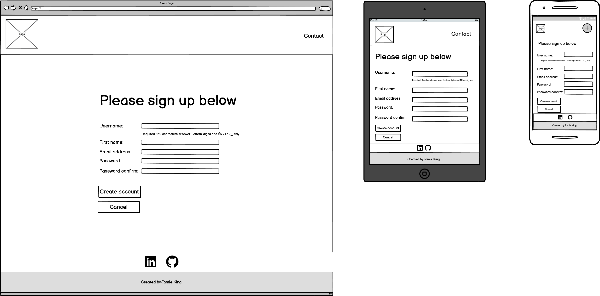

## Technologies Used

### Coding Languages
- HTML
- CSS
- Python 3
- Javascript

### Frameworks and Tools

- [Django 3.2.16](https://www.djangoproject.com/) - Used to rapidly develop the site.
- [Psycopg2](https://pypi.org/project/psycopg2/) - Used as a PostgreSQL adaptor
- [Gunicorn](https://gunicorn.org/) - Used for being a pure-Python HTTP server for WSGI applications
- [Git](https://git-scm.com/) - Used for version control.
- [GitHub](https://github.com/) - Used to deploy the projects code.
- [Gitpod](https://www.gitpod.io/) - Used to develop and test code.
- [Heroku Platform](https://id.heroku.com/) - Used to deploy the live project.
- [Crispy Forms](https://django-crispy-forms.readthedocs.io/en/latest/) - Used to format forms.
- [Website Mockup Generator](https://websitemockupgenerator.com/) - Used to create a mock up image of the site on different screen sizes.
- [Balsamiq](https://balsamiq.com/) - Used to produce wireframes of the site.
- [Boostrap 5](https://getbootstrap.com/docs/5.0/getting-started/introduction/) - Used to develop the layout of the site.
- [Cloudinary](https://cloudinary.com/) - Used to store post images.
- [Font Awesome](https://fontawesome.com/) - Used to produce icons on the site.
- [Graphviz](https://dreampuf.github.io/GraphvizOnline) - Used to generate pydot file / database diagram image.
- [Google Fonts](https://fonts.google.com/) - Used to import the sites font family.
- [Affinity Designer](https://affinity.serif.com/en-gb/) - Used to create the logo and delete buttons.
- [Validation](#validation)
    - [WC3 Validator](https://validator.w3.org/) - Used to validate the HTML code of the site.
    - [Jigsaw W3 Validator](https://jigsaw.w3.org/css-validator/)- Used to validate the CSS of the site.
    - [Jshint](https://jshint.com/) - Used to validate the Javascript of the site.
    - [Pycodestyle](https://pypi.org/project/pycodestyle/) - Used to validate code against Python conventions.
    - [Chrome dev tools (Lighthouse)](https://developer.chrome.com/docs/lighthouse/overview/) - Used to measure site performance, SEO and accessiblity
    - [WAVE Validator](https://wave.webaim.org/) - Used to evaluate site accessibility

### Libraries

#### Installed Libraries

| Package       | Version        |
| ------------- | ------------- |
| asgiref | 3.5.2 |
| cloudinary | 1.30.0 |
|coverage    |           7.0.3 |
| dj-database-url | 0.5.0 |
| dj3-cloudinary-storage | 0.0.6 |
| Django | 3.2.16 |
| django-crispy-forms | 1.14.0 |
| django-extensions | 3.2.1 |
| gunicorn | 20.1.0 |
| psycopg2 | 2.9.5 |
| pydot | 1.4.2 |
| pyparsing | 3.0.9 |
| pytz  | 2022.6 |
| sqlparse | 0.4.3 |

## Features

In its entirety the website consists of a variety of features across the many site pages as listed below.

### Authentication

Authentication is a feature of the Pic Pals site, users will have to be authenticated whilst attempting to log in or else they will not be able to use any functionality of the site or view any information that pic pals users have posted.

Authentication image

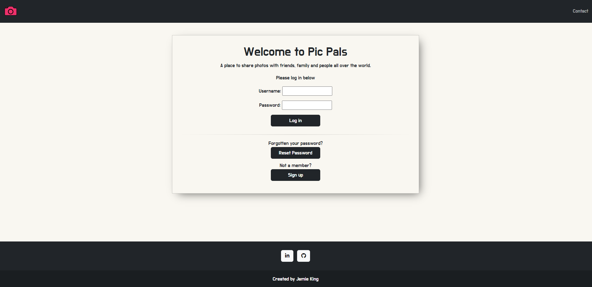

- Covered in user stories: 28

### Bio-Section

The bio section is an optional feature to appear on a users profile page. A user can chose to write a little bit about themselves if they so desire. The location of the bio section is just above the users posts.

Bio section image

- Covered in user stories: 19

### Change Password

The change password feature can be accessed from the current users profile page. A form will prompt the user to enter their current password followed by their new password and a confirmation of the new password.

Change password image

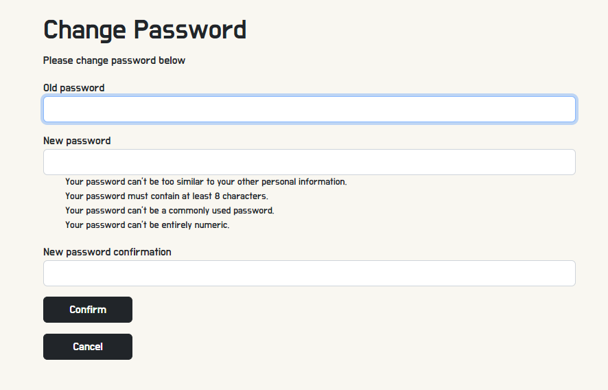

- Covered in user stories: 13

### Post comment

The post comment feature can be accessed from any users post detail page, below the post image is a form to enter a comment. The comment will then be posted alongside the users profile picture and username.

Post comment image

- Covered in user stories: 6 & 7

### Contact

The contact feature can be found from the nav bar and allows both signed in users and annonymous users to contact the site admin.

Contact image

- Covered in user stories: 21

### Create Post

The create post feature can be found from the current logged in users profile page. This will allow a logged in user to post an image to their profile.

Create Post image

- Covered in user stories: 8

### Delete Post

The delete post feature can be found above the image on the post detail page of a currently logged in user. The delete post button will only be visible to owners of that post to avoid other users deleting posts they do not own.

Delete Post images

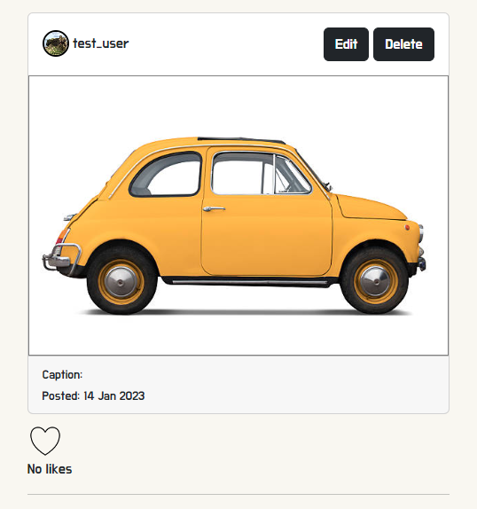
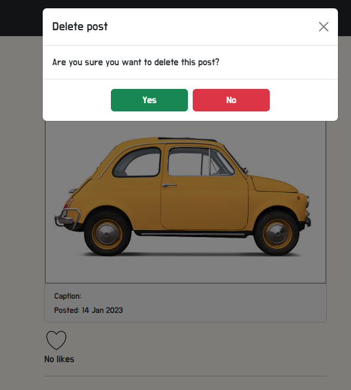

- Covered in user stories: 4, 8 & 29

### Edit Post

The edit post feature can be found above the image on the post detail page of a currently logged in user and allows the captoion of the post to be updated. The edit post button will only be visible to owners of that post to avoid other users editing posts they do not own.

Edit post images

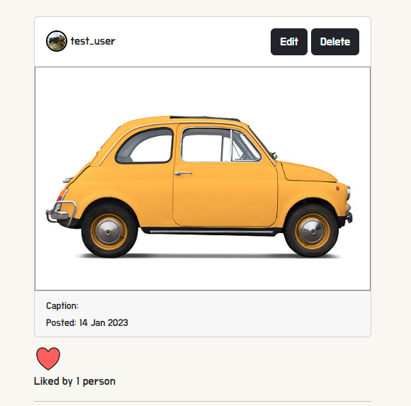

- Covered in user stories: 5 & 8

### Edit Profile

The edit profile feature can be found on the profile page of the current logged in user beside the Add post button. Clicking the edit profile button will redirect to a form in which the user can update their details.

Edit Profile image

- Covered in user stories: 15 & 22

### Error Pages

The error pages features will display 400, 403, 404 and 500 error pages and allow the user to easily navigate back to the site.

Error Pages image

- Covered in user stories: 32

### Feed

The feed feature can be found from the Nav Bar. The feed feature will display the posts of all followed users by the current user in a list sorted by latest to oldest.

Feed image

- Covered in user stories: 24

### Follow / Unfollow user

The follow / unfollow user feature allows users to follow or unfollow other users, if a user is followed their posts will appear in current users feed.

Follow / Unfollow user image

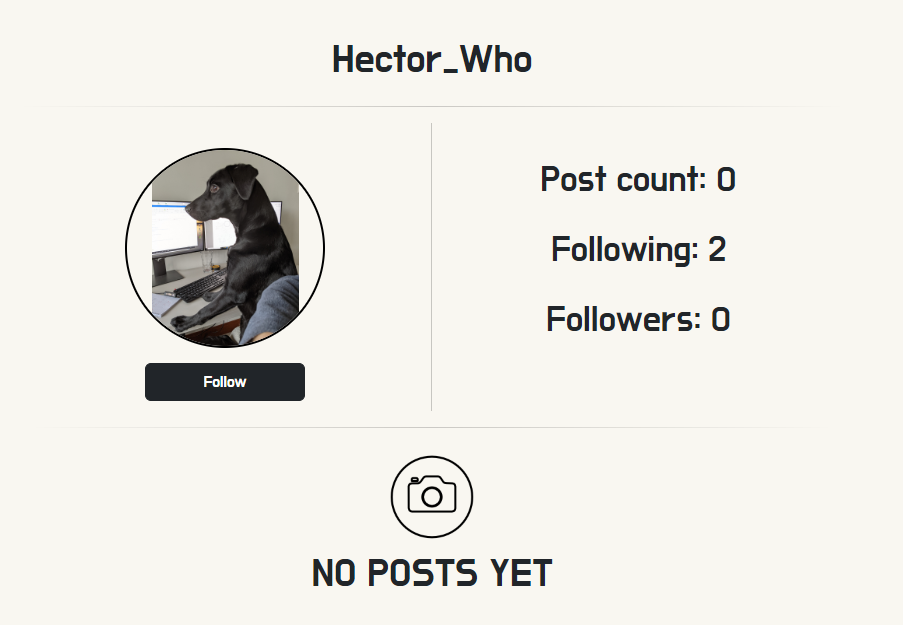

- Covered in user stories: 20

### Follow / Unfollow button 

The follow / unfollow user button feature can be found on the profile of any user just below their profile picture. The button text will reflect the current status of the user as FOLLOW or UNFOLLOW.

Follow / Unfollow button image

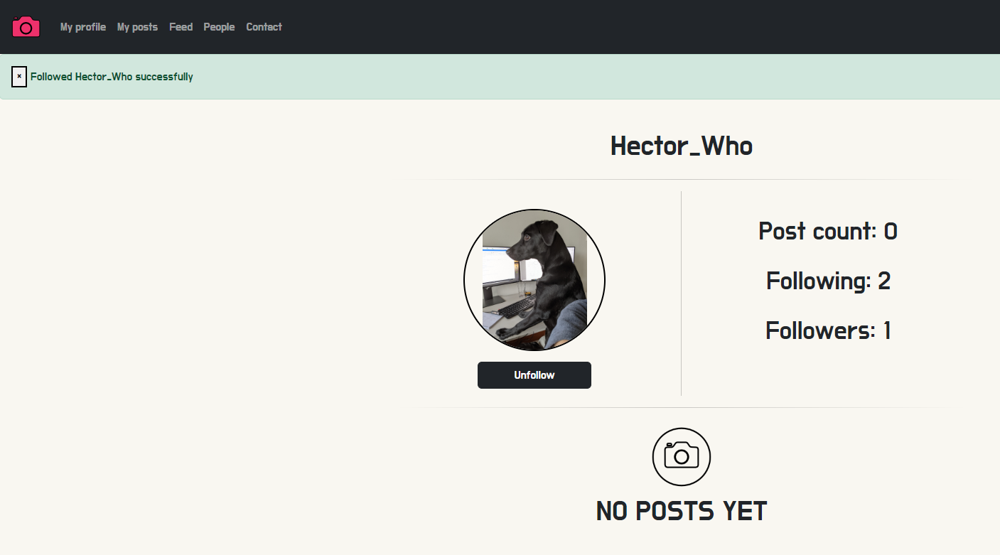

- Covered in user stories: 2 & 26

### Followed List

The followed list feature can be accessed from the currently logged in users profile. This feature will display a list of all users that the current user follows.

Followed list image

- Covered in user stories: 25

### Followers List

The followers list feature can be accessed from the currently logged in users profile. This feature will display a list of all users that the current user is followed by.

Followers list image

- Covered in user stories: X ADD USER STORY

### Home Page

The home page feature displays upon initial arrival to the pic pals site and will allow users to log into Pic Pals, Rest password, Register an account and Contact the admin.

Home page image

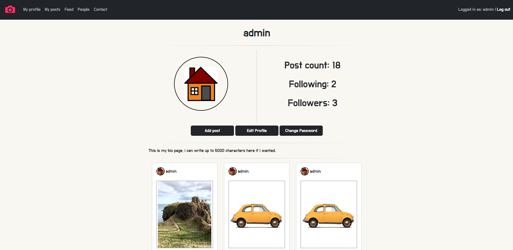

- Covered in user stories: 17

### Input Validation

Input Validation as a feature is used throughout the site for form inputs.

Input validation image

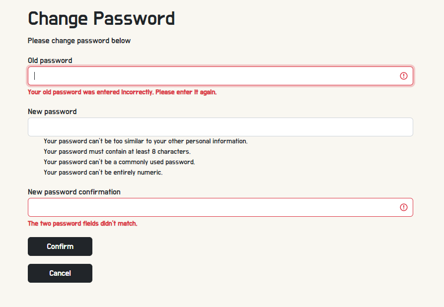

- Covered in user stories: 27

### Like count

The like count feature can be found under a post image in the post details page. The total number of likes on the current post will be displayed.

Like count image

- Covered in user stories: 18

### Like / Unlike button

The like / unlike button feature can be found under a post image in the post details page. A user can click on the like button and it will add / subtract a like based on the users current like status for that post.

Like / Unlike Button image

- Covered in user stories: 2 & 3

### Register

The register feature can be found on the landing page for the site. This feature allows users to register and create an account with pic pals via a form.

Register image

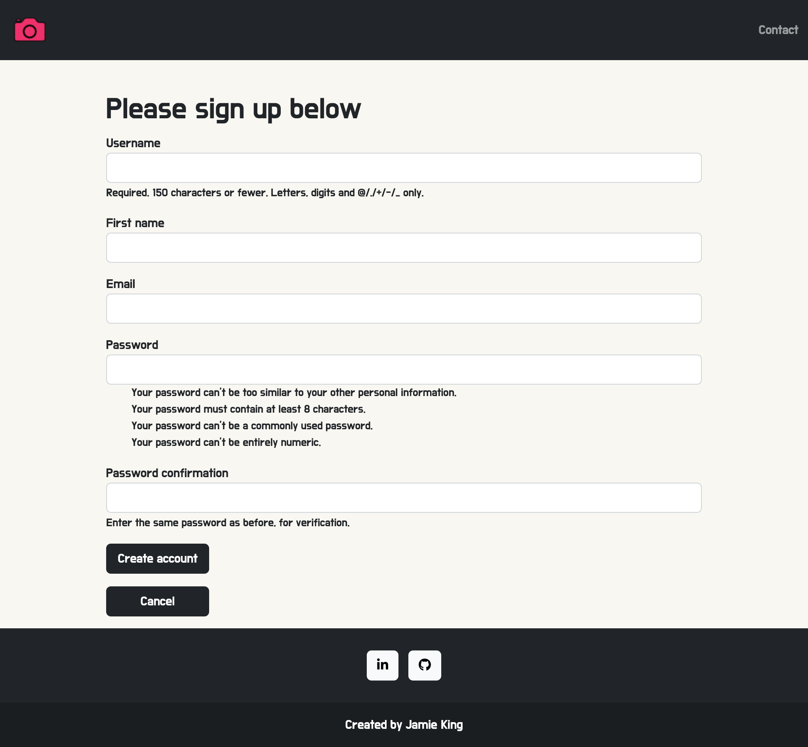

- Covered in user stories: 12

### Reset Password

The reset password feature can be found on the landing page for the site. This feature allowed users to be emailed with a one use token to the email registered to their account. *Please note that this feature works on the CLI only, Google Mail times out, please see known bugs.

Reset Password image

- Covered in user stories: 9

### Responsiveness

Throughout the site the feature of being responsive for various device sizes can be shown whilst navigating the site.

Responsiveness image

- Covered in user stories: 30

### Site Feedback

Site feedback features are presented at various times in the form of Successfull html pages and Django messages.

Feedback images

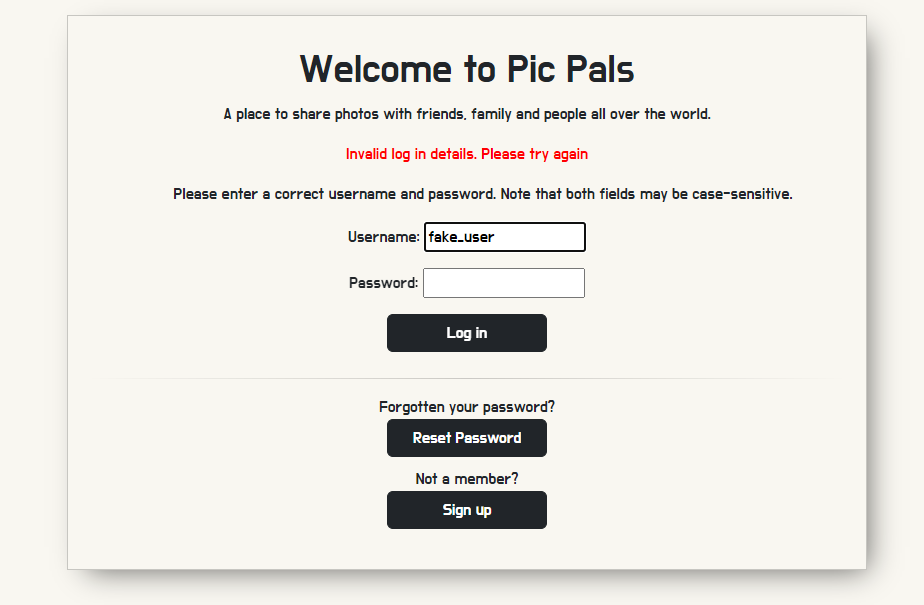

- Covered in user stories: 23

### User Search

The user search bar feature can be found on the People page of the site. At the top of the People page a search bar can be used to search for users by username.

User Search image

- Covered in user stories: 31

## Validation

### HTML Validation

[W3C Validation](https://validator.w3.org/) was used to validate the HTML code used in the project.

HTML file - xxx.html

HTML file - xxxx.html

HTML file - xxx.html

HTML file - xxxx.html

### CSS Validation

[W3C Validation](https://validator.w3.org/) was used to validate the CSSL code used in the project.

CSS file - style.css

### JavaScript Validation

[JSHint](https://jshint.com/) was used to validate the Javascript code used in the app.

Javascript file - script.js

In addition to this there are two scripts which are in templates, these have been e

### Python Validation

At the time of creating this 

[PEP-8 Validation](http://pep8online.com/) was used to validate the Python code used in the app.

Python file - run.py

### Chrome Dev Tools Lighthouse Validation

[Chrome Dev Tools lighthouse](https://developer.chrome.com/docs/lighthouse/overview/) was used to validate the performance of the app.

PAGE NAME

### WAVE Validation

[WAVE Validation](http://pep8online.com/) was used to validate the accessiblity of the app.

PAGE NAMEy

## Testing

### Device Testing

This site was tested on the following devices:
- Windows 10 PC with a 24" MSI Curved gaming monitor
- Raspberry Pi 4 with a 24" MSI Curved gaming monitor

### Browser Compatibility

The website was tested on the following web browsers:
- Google Chrome (Version 108.0.5359.125)
- DuckDuckGo

### Manual Testing

See Testing User Stories

#### Testing User Stories - Users

To avoid unnecessary repetition of images, only the feature being referred to will have screenshots. Information on how to navigate to the feature referred to will be described within its relevant table reference. 

1. As a user, I want to use the navigation bar so that i can seamlessly navigate around the app.

| Feature       | Action        | Expected Result  | Actual Result |
| ------------- | ------------- | -------------    | ------------- |
|  Nav Bar  | Log in and scroll to the top of any page  | Nav Bar to be displayed along the top of the page or via a hamburger toggle if on a smaller screen    | Works as expected |

Screenshots User Story 1

Feature - Nav Bar

2. As a user, I want to see a visual indicators for example of having liked a post / followed a user so that i can tell if I have previously like that post.

| Feature       | Action        | Expected Result  | Actual Result |
| ------------- | ------------- | -------------    | ------------- |
|  Like Button  | Log in and navigate to a post detail page via feed or a users profile by clicking on the post. Below the post click on the heart icon to like or unlike the post  | Post heart indicator to visually reflect the current users status with regards to liking the post and the total like tally to plus or minus one like dependant on if the click is a like or unlike  | Works as expected |
|  Follow Button  | Log in and navigate to a users profile page via followed users list, following users list or clicking on the users name on a post detail. Below the users profile picute click on the follow button to follow or unfollow the user.  | User to follow or unfollow the account of the currently viewed profile | Works as expected |

Screenshots User Story 2

Feature - Like / Follow Button

3. As a user, I want to like and unlike posts so that i can show my appreciation of another users post.

| Feature       | Action        | Expected Result  | Actual Result |
| ------------- | ------------- | -------------    | ------------- |
|  Like Button  | Log in and navigate to a post detail page via feed or a users profile by clicking on the post. Below the post click on the heart icon to like or unlike the post  | Post heart indicator to visually reflect the current users status with regards to liking the post and the total like tally to plus or minus one like dependant on if the click is a like or unlike | Works as expected |

Screenshots User Story 3

Feature - Like / Unlike Button

4. As a user, I want to delete my posts so that i can permanently remove posts I do not wish to keep.

| Feature       | Action        | Expected Result  | Actual Result |
| ------------- | ------------- | -------------    | ------------- |
|  Delete Post  | Log in and navigate to the post detail by clicking on the post in question. At the top of the post card click on the delete button, click ok on the confirmation modal to delete the post. | Post to be deleted | Works as expected |

Screenshots User Story 4

Feature - Delete Post

5. As a user, I want to edit my posts so that i can correct spelling mistakes or hashtags I may have enter into comments.

| Feature       | Action        | Expected Result  | Actual Result |
| ------------- | ------------- | -------------    | ------------- |
| Edit Post  | Log in and navigate to the post detail by clicking on the post in question. At the top of the post card click on the edit button, the edit post form will show, update the caption field to the desired caption and click update to save changes and redirect back to the post detail page.  | Caption for the post to be updated | Works as expected |

Screenshots User Story 5

Feature - Edit Post

6. As a user, I want to view post comments so that i can fulfill the aim of the app.

| Feature       | Action        | Expected Result  | Actual Result |
| ------------- | ------------- | -------------    | ------------- |
|  Comment on post  | Log in and navigate to a post detail page via feed or a users profile by clicking on the post. Below the post image view the comments.  | User to be able to read all comments on the post or be made aware of no comments if there are none | Works as intended |

Screenshots User Story 6

Feature - Comment on post

7. As a user, I want to comment on other posts so that i can interact with other users.

| Feature       | Action        | Expected Result  | Actual Result |
| ------------- | ------------- | -------------    | ------------- |
|  Comment on post  | Log in and navigate to a post detail page via feed or a users profile by clicking on the post. Below the post image fill in the comment form and click on the add comment button.  | User to fill in the comment form and when submitted will be added to the comments like for the post. | Works as expected |

Screenshots User Story 7

Feature - Comment on post

8. As a user, I want to manage my posts so that i can add, edit or delete posts as needed.

| Feature       | Action        | Expected Result  | Actual Result |
| ------------- | ------------- | -------------    | ------------- |
|  Edit Post  | Log in and navigate to the post detail by clicking on the post in question. At the top of the post card click on the edit button, the edit post form will show, update the caption field to the desired caption and click update to save changes and redirect back to the post detail page.  | Caption for the post to be updated    | Works as expected |
|  Delete Post  | Log in and navigate to the post detail by clicking on the post in question. At the top of the post card click on the delete button, click ok on the confirmation modal to delete the post. | Post to be deleted | Works as expected |

Screenshots User Story 8

Feature - Edit Post / Delete Post

9. As a user, I want to request a password so that i can log back into my account if i have forgotten my password.

| Feature       | Action        | Expected Result  | Actual Result |
| ------------- | ------------- | -------------    | ------------- |
|  Reset Password  | Navigate to the pic pals site and click on the Reset Password button located below the log in section. Fill in the form with the email used when creating your pic pals account and submit the form. Navigate to your email inbox and find the email from Pic Pals. Click on the link which will direct you to a form on pic pals to enter a new password. Confrim the password and submit the form.  | User will reset their password allowing them to log into their account | Works as intended *See known bugs |

Screenshots User Story 9

Feature - Reset Password

10. As a user, I want to log in so that i can access my account, view my profile, pictures and other users pictures.

| Feature       | Action        | Expected Result  | Actual Result |
| ------------- | ------------- | -------------    | ------------- |
|  Log in  | Naviagte to the pic pals site and from the landing page enter your username and password then click on the log in button.  | User to log in and be redirected to their profile page | Works as expected |

Screenshots User Story 10

Feature - Log in

11. As a user, I want to log out so that other users using the same device cannot access my account.

| Feature       | Action        | Expected Result  | Actual Result |
| ------------- | ------------- | -------------    | ------------- |
|  Log out  | From any page whilst logged in click on the log out button located in the right hand corner of the nav bar, or if using a small screen device from the last item in the list from the hamburger menu toggle.  | User to log out successfully and be presented with the logged out page | Works as intended |

Screenshots User Story 11

Feature - Log out

12. As a new user, I want to register an account with Pic Pals so that i can become a member and use the app as intended.

| Feature       | Action        | Expected Result  | Actual Result |
| ------------- | ------------- | -------------    | ------------- |
|  Register  | Navigate to the pic pals site and click on the Sign up button located below the log in section. Fill in the form with the required fields for registration and click on the create account button.  | User to create an account with the information provided in the form    | Works as intended |

Screenshots User Story 12

Feature - Register

13. As a user, I want to change my password so that i can secure my account.

| Feature       | Action        | Expected Result  | Actual Result |
| ------------- | ------------- | -------------    | ------------- |
|  Change Password  | Log in and navigate to the My profile page by clicking My Profile from the nav bar. Click on the edit profile button located under the Users profile picture. Fill in the form with updated profile detail and click on the update profile button  | Users profile to be updated with the information entered into the edit profile form | Works as expected |

Screenshots User Story 13

Feature - Change Password

14. As a user, I want to have a profile page so that I and other users can view my list of posts.

| Feature       | Action        | Expected Result  | Actual Result |
| ------------- | ------------- | -------------    | ------------- |
|  Profile Page  | Create an account with Pic Pals or sign in if already a member, navigate to the My Profile page from the Nav Bar  | User to have their own profile on the site | Works as intended |

Screenshots User Story 14

Feature - Profile Page

15. As a user, I want to update my profile so that my profile can stay up to date with my latest information.

| Feature       | Action        | Expected Result  | Actual Result |
| ------------- | ------------- | -------------    | ------------- |
|  Edit Profile  | Log in and navigate to the My profile page via the nav bar. Click on the Edit profile button located below the users profile picture. The user will then be redirected to the edit profile form, fill out new information as intedned and click on the update profile button   | Users profile information to be updated and saved | Works as intended |

Screenshots User Story 15

Feature - Edit profile

16. As a user, I want to add a profile picture so that my followers can easily recognize my posts or comments.

| Feature       | Action        | Expected Result  | Actual Result |
| ------------- | ------------- | -------------    | ------------- |
|  Profile Picture  | Sign up with pic pals and whilst entering user information upload a picture to be a profile picture, if no image is selected the static default profile picture will be used. If a user already has an account, log in and navigate to the My Profile page from the nav bar. Click on the edit profile button located below the users profile image. Upload the desired image and click on update profile  | User will have a personally selected image as their profile image | Works as intended |

Screenshots User Story 16

Feature - Profile Picture

17. As a user, I want to view the Home Page so that i can understand what the website is about, create an account or log in.

| Feature       | Action        | Expected Result  | Actual Result |
| ------------- | ------------- | -------------    | ------------- |
|  Home Page  | Navigate to the pic pals landing page  | Users will be presented with a small description of the sites purpose | Works as intended |

Screenshots User Story 17

Feature - Home Page

18. As a user, I want to view how many likes a post has so that i can gauge how popular a post is.

| Feature       | Action        | Expected Result  | Actual Result |
| ------------- | ------------- | -------------    | ------------- |
| Like count  | Log in and navigate to any post detail page via one of the methods to do so as explained above. Scroll down to below the post image and the like count will be displayed  | To view the total amount of likes a post has. | Works as expected |

Screenshots User Story 18

Feature - Like count

19. As a user, I want to add a bio to my profile page so that other members can learn more about me.

| Feature       | Action        | Expected Result  | Actual Result |
| ------------- | ------------- | -------------    | ------------- |
|  Bio Section  | Log in and navigate to the My profile page via the nav bar. Click on the Edit profile button located below the users profile picture. The user will then be redirected to the edit profile form, fill out out the bio field and click on the update profile button  | Users profile to display their bio field above their posts | Works as intended |

Screenshots User Story 19

Feature - Bio Section

20. As a user, I want to follow other accounts so that i can view their posts on my feed.

| Feature       | Action        | Expected Result  | Actual Result |
| ------------- | ------------- | -------------    | ------------- |
|  Follow  | Log in and navigate to the People page of the site located in the Nav Bar, scroll or use the search bar to find the account whom is wished to follow. Click on the follow button located under the profiles profile picture.  | User will follow the desired account, a django message will confirm the follow and the button will change from a "follow" button to an "unfollow" button.    | Works as intended |

Screenshots User Story 20

Feature - Follow

21. As a user, I want to fill in a help form so that i can enquire about issues I may have regarding the app.

| Feature       | Action        | Expected Result  | Actual Result |
| ------------- | ------------- | -------------    | ------------- |
|  Contact  | Click on the contact link in the nav bar which will be located at the end of the list, or if not signed in will appear on the right hand side of the nav bar. Fill in the forms fields and click on the submit button  | User form will be submitted and a django message will confirm this.   | Works as intended |

Screenshots User Story 21

Feature - Contact

22. As a user, I want to change my email address so that i can maintain the same account if I change email address.

| Feature       | Action        | Expected Result  | Actual Result |
| ------------- | ------------- | -------------    | ------------- |
|  Edit Profile  | Log in and navigate to the My Profile page by clicking on the link in the nav bar. Click on the edit profile button located below the user profile picture. Type in the desired email address in the email field and click submit.  | Users profile will update to be that of the newly entered email address | Works as intended |

Screenshots User Story 22

Feature - Edit profile

23. As a user, I want to receive feedback so that i can confirm the contact form submission was successful or not.

| Feature       | Action        | Expected Result  | Actual Result |
| ------------- | ------------- | -------------    | ------------- |
|  Site Feedback  | Navigate to one of the forms in the site for example the contact form> Fill in the form and submit it to be presented with the success / unsuccessfully message feedback  | User to complete an operation for example submitting a contact form and be presented with feedback as to if the form was submitted. | Works as intended. |

Screenshots User Story 23

Feature - Site feedback

24. As a user, I want to scroll through the latest images on my feed so that i can keep up to date with accounts I follow.

| Feature       | Action        | Expected Result  | Actual Result |
| ------------- | ------------- | -------------    | ------------- |
|  Feed  | Log in and navigate to the feed page which can be accessed via the nav bar by clicking on the Feed link. Scroll through the image list that is made up of followed accounts posts.  | User will be presented with a list of all followed users posts in order of date created from newest to oldest. | Works as expected |

Screenshots User Story 24

Feature - Feed

25. As a user, I want to browse my list of followed accounts so that i can view that particular user account.

| Feature       | Action        | Expected Result  | Actual Result |
| ------------- | ------------- | -------------    | ------------- |
| Followed List  | Log in and navigate to the My Profile page, this can be accessed from clickin on the My Post link in the nav bar. Within the Profile info panel at the top of the page click on the FOLLOW count. This will then display a list of followed accounts.  | User to be displayed with a list of all users they currently follow. | Works as expected |

Screenshots User Story 25

Feature - Followed List

26. As a user, I want to see a visual indicator of following an account so that i can tell if I currently follow that account.

| Feature       | Action        | Expected Result  | Actual Result |
| ------------- | ------------- | -------------    | ------------- |
|  Follow / Unfollow button  | Log in and navigate to a users profile page via the People link in the Nav Bar. Below the users profile picture locate the follow button which will indicate if the user is currently followed. If a user is followed the button will display UNFOLLOW and if not followed will display FOLLOW  | Follow button indicator to visually reflect the current following status by showing the relevant message on the button  | Works as expected |

Screenshots User Story 26

Feature - Follow / Unfollow button

#### Testing User Stories - Site Owner

27. As the site owner, I would want to validate users data entries on sign up so that users can create a log in which meets the requirements.

| Feature       | Action        | Expected Result  | Actual Result |
| ------------- | ------------- | -------------    | ------------- |
|  Input Validation  | User to enter data into one of the many forms form fields | Whilst user entering data into a form fields, if the users input does not meet the requirements a prompt will indicate the relevant issue with the users input | Works as intended |

Screenshots User Story 16

Feature - Input Validation

28. As the site owner, I would want to ensure only logged in users can post from their account and edit their profile so that data privacy is ensured.

| Feature       | Action        | Expected Result  | Actual Result |
| ------------- | ------------- | -------------    | ------------- |
|  Authentication  | User to log in via the login page and make a post from the My Profile page  | User to be authenticated via Djangos auth_user and the login view to ensure only a user logged in can post a post from that particular account | Works as expected |

Screenshots User Story 16

Feature - Authentication

29. As the site owner, I would want to have the ability to remove posts so that i can keep the app clean and friendly.

| Feature       | Action        | Expected Result  | Actual Result |
| ------------- | ------------- | -------------    | ------------- |
|  Delete Post  | Admin to log into the admin site of the app and from their go to the posts object and delete the required post database entry  | Admin to log into the admin site and have the ability to delete a post of any user as this profile is a super user | Works as intended |

Screenshots User Story 16

Feature - Delete Post

30. As the site owner, I would want the site to be fully responsive so that user can use it across multiple devices and create a good user experience.

| Feature       | Action        | Expected Result  | Actual Result |
| ------------- | ------------- | -------------    | ------------- |
|  Responsiveness  | Allow users to use the site on their own device regardless of the size  | The site is functional and works as intended on a range of device screen sizes  | Works as intended |

Screenshots User Story 16

Feature - Responsiveness

31. As the site owner, I would want to use the app search function so that i can search for particular users by their user name.

| Feature       | Action        | Expected Result  | Actual Result |
| ------------- | ------------- | -------------    | ------------- |
|  User Search  | Log in as admin, navigate to the People page via the Nav Bar located at the top of the page. At the top of the page will be the search bar, enter the username and press enter.  | The searched for users profile will list, additionally if other users username has the same text they will show. If no user is found with that user name a message will display stating that no user with that username exists | Works as intended |

Screenshots User Story 16

Feature - User Search

32. As the site owner, I would want 404 and 500 error pages so that users do not have to use the back navigation button if an error occurs.

| Feature       | Action        | Expected Result  | Actual Result |
| ------------- | ------------- | -------------    | ------------- |
|  Error Pages  | User to attempt to navigate to a page that doesnt exist or use the site whilst there is a server error. This will display the relevant Error page and return home button  | Error page of the relevant error to display informing the user of the error and allowing them to redirect with the use of a button and not having to click the browser back buttons | Works as intended |

Screenshots User Story 16

Feature - Error pages

### Automated Testing

See unit testing

Using Djangos Unit tests from Pythons standard library module unittest i wrote a series of unit test to test for correct operation of Classes and functions. The overall report findings were produced using the coverage tool.

Unit testing Code

Unit testing Result

## Bugs

During the project I encountered a number of bugs some of which were solved some of which were not as stated below:

| Bug           | Fix           |
| ------------- | ------------- |
| Django urls not working | As i had used app name spaces i hadnt included the app name followed by : therefore Django couldnt find the templates. All instances referring to Django urls with name spaces were updated to the correct format and the bug was resolved.|
| Databse migration error | id column in database was edited after creation, after talking with tutor support it wasa deemed the best way to fix this issue was to reset my database, delete all existing migrations and then migrate the database again. After migration the database worked as intended and the bug was resolved |
| Images not uploading to Cloudinary | Post images were not being sent and stored on cloudinary, a simple mismatch of variable names was the cause and upon updating the bug was resolved. |
| Static files not showing | Static files would not be loaded by the browser, after searching online i came across a similar issue and the method of fixing this bug was to install the third party library called whitenoise. Upon installation of whitenoise and adding it to the middelware in my settings static files were now loaded in the browser and the bug was resolved | 
| Follow button would not update to reflect the current follow status | When initially created the filter for the follow object was checking if a follow object for that user existed and not if an object between the request user and the user of the viewing profile existed therefore the button would always state unfollowed aslong as at least one user followed that account. The filter was updated to filtered the relationship between the request user and the user of the profile and the bug was resolved  |
| Delete post confirmation modal would still delete post when cancelled | The achor for tag was intially wrapped around the delete button therefore no matter what was pressed on the modal it would still redirect to the delete post page and delete the post, to fix this the anchor was moved to wrap around the ok button of the modal which provided the intended outcome and the bug was resolved.| 
| Reset password wont send an email via Google Mail | At present i have no fix for this, the google mail server just continues to time out. As this function can still be tested using the django email backend setting and returning the one time link via the command line i have decided to keep this feature in my project but class it as a known bug as it does not affect the functioning of the program. |
| Post cards would be the height of the largest image in the lists row leaving whitespace below images in cards that are shorter | This was down to simple CSS styling of the class being allocated to the wrong divs. Once this was moved and updated all posts then had the same height and the image was resized within the card with white space above and below to maintain the correct image ratio thus resolving the bug. |
| Post created without image | There was no requirement for the image field in the post form which could allow a user to post an empty post. Once the field was set to be required the b ug was resolved |

## Configuration

### Google emails

To set up the project to send emails and to use a Google account as an SMTP server, the following steps are required:

1. Create an email account at google.com, login, click you user icon and then on 'Manage Your Google Account'
2. Click on the Security tab
3. Turn on 2-step verification and follow the steps to enable
4. Click on App passwords, click on Select app and choose Other
5. Give your app a name and click on 'Generate' 

6. A 16 digit password will be generated, note the password down
7. Set the below variables within the settings.py file to successfully send emails
 <code>EMAIL_BACKEND = 'django.core.mail.backends.smtp.EmailBackend'</code>
 <code>EMAIL_HOST = 'smtp.gmail.com'</code>
 <code>EMAIL_HOST_USER = os.environ.get('EMAIL_HOST_USER')</code>
 <code>EMAIL_HOST_PASSWORD = os.environ.get('EMAIL_HOST_PASSWORD')</code>
 <code>EMAIL_PORT = '587'</code>
 <code>EMAIL_USE_TLS = True</code>
8. Set up the variables EMAIL_HOST_USER and EMAIL_HOST_PASSWORD in your Render application Config vars

## Deployment

### Heroku

This project was deployed to Heroku in the project's early stages to allow continual responsive testing. This was achieved via the following steps:

The website was deployed with Heroku by following these steps:

1. Use the "pip freeze -> requiremnts.txt" command in the terminal to save any libraries that need to be installed in the file.
2. The app uses Cloudinary to host the post images therefore a Cloudinary account will be required. 
3. Log in to [Cloudinary](https://cloudinary.com/) or create an account for free.
4. Navigate to the Dashboard on Cloudinary

Screenshot

5. Copy and store the value of the 'API Environment Variable" beginning at cloudinary:// until the end, this will be used in the Heroku Config Vars. 
6. The app also uses ElephantSQL to host the database
7. Log in to [ElephantSQL](https://www.elephantsql.com/) or create an account for free.
8. Click on Create a new instance

Screenshot

9. Set up your plan. Give the 'plan' the desired name, select the Tiny Turtle (free) plan and leave tags blank.

Screenshot

10. Select region and chose the nearest data centre to your location.

Screenshot

11. Click 'review' and if happy with the details presented click on the create instance button.

Screenshot

12. From the instances section click on the instance with the name that was just created.
13. Get the ElephantSQL database URL from the instance details page and copy, this will be used in the Heroku Config Vars

Screenshot

14. Navigate to https://www.heroku.com/ and login or create an account. 
15. Click the "new" button in the upper right corner and select "create new app".

Screenshot

16. Choose an app name and your region and click "Create app".

Screenshot

17. Reveal Config Vars and store the required config var names and values as below:

- `CLOUDINARY_URL`: *your cloudinary URL as obtained above*
- `DATABASE_URL`: *your ElephantSQL postgres database URL as obtained above*
- `PORT`: `8000`
- `SECRET_KEY`: *your secret key*

Screenshot

18. Go to the "deploy" tab and pick GitHub as a deployment method.
19. Search for a repository to connect to and select the branch you would like to build the app from.
20. If preferred enable automatic deploys and then deploy branch.
21. Wait for the app to build and then click on the "View" link which will redirect you to the deployed link.

### Forking the GitHub Repository

We can make a copy of the original repository on our GitHub account to view or make changes too without affecting the original repository, this is known as forking. Forking in GitHub can be done via the following steps:

1. Navigate to www.github.com and log in.
2. Once logged in navigate to the desired [GitHub Repository](https://github.com/jkingportfolio/CI_PP4_Pic_Pals) that you would like to fork.
3. At the top right corner of the page click on the fork icon.
4. There should now be a copy of your original repository in your GitHub account.

Please note if you are not a member of an organisation on GitHub then you will not be able to fork your own repository.

### Clone a GitHub Repository

You can make a local clone of a repository via the following steps: 

1. Navigate to www.github.com and log in.
2. Once logged in navigate to the desired [GitHub Repository](https://github.com/jkingportfolio/CI_PP4_Pic_Pals) that you would like to clone.
3. Locate the code button at the top, above the repository file structure.
4. Select the preferred clone method from HTTPS. SSH or GitHub CLI then click the copy button to copy the URL to your clipboard.
5. Open Git Bash
6. Update the current working direction to the location in which you would like the clone directory to be created.
7. Type `git clone` and paste the previously copied URL at Step 4.
8. `$ clone https://github.com/jkingportfolio/CI_PP4_Pic_Pals`
9. Now press enter and the local clone will be created at the desired local location

## Credits

### Tutorials

- Real Python Django redirects tutorial - [The Ultimate Guide to Django Redirects](#https://realpython.com/django-redirects/)
- Sending user_logged_in signals - [Django rest auth user_logged_in signal](#https://stackoverflow.com/questions/43300305/django-rest-auth-user-logged-in-signal)
- Using django extensions to generate a database diagram - [Medium - Visualize database in Django](https://medium.com/@yathomasi1/1-using-django-extensions-to-visualize-the-database-diagram-in-django-application-c5fa7e710e16)

### Code

 Code from external sources were used as a basis and built on top of in this project, they are credited below:

 - Code snippet on how to dynamically add the follow field to User used in the account apps models.py file was taken from the book Django 4 By Example - [Django 4 By Example](#https://www.packtpub.com/product/django-4-by-example-fourth-edition/9781801813051)
 - Scroll to top Javascript function to allow users to click and auto scroll to top of page was used from the W3Schools site - [W3Schools](#https://www.w3schools.com/howto/howto_js_scroll_to_top.asp)

### Literature

The use of reference books were used throughout the creation of this project and are credited below:

- Django 4 By Example - Fourth Edition by Antonio Mel, published by Packt Publishing

### Misc

The source of where I learned how to produce a GitHub fork and clone was from the following pages of the GitHub Documentation. Although I did not use a fork or clone in this project it is something I hope to implement to future projects now I have the knowledge to do so.

- https://docs.github.com/en/get-started/quickstart/fork-a-repo
- https://docs.github.com/en/repositories/creating-and-managing-repositories/cloning-a-repository

## Acknowledgements

I would like to also thank the following:
- My wife and family for their support and feedback whilst doing this project
- [Andy Guttridge](https://github.com/andy-guttridge) for his huge help through out the project!
- Code Institute tutor support who helped with an issue i had with having to reset my database.
- My Code Institute mentor Mo Shami for his guidance through this project.

[Back to Top](#pic-pals)